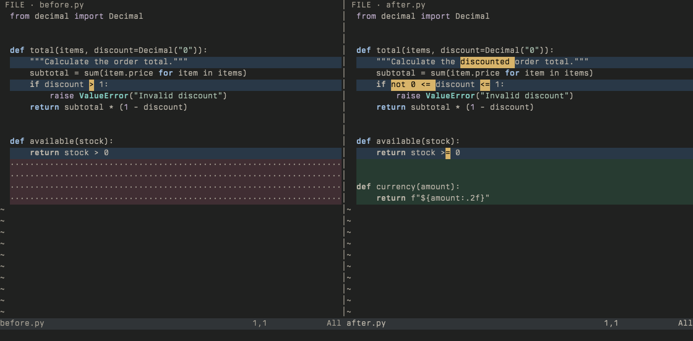
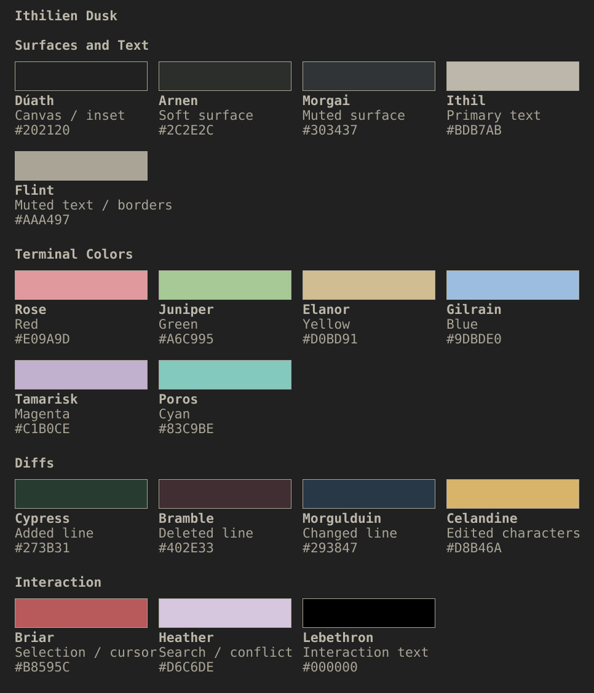

# Ithilien

Two Neovim colorschemes for clear code and precise diffs: **Dawn**, porcelain and black, and **Dusk**, warm gray on graphite.

Restrained syntax, 18 colors per theme, and amber highlights for exact edited characters. Both themes share selection, cursor, search, and diff-emphasis colors.

## Themes

Expand a theme to see its Neovim preview and full palette.

<details>
<summary><strong>Ithilien Dawn</strong> — light · porcelain and black</summary>


Shown in Berkeley Mono Medium, 16 pt. [Named colors and roles](docs/palette-names.md).

</details>

<details>
<summary><strong>Ithilien Dusk</strong> — dark · warm graphite</summary>





Shown in Berkeley Mono Retina, 16 pt. [Named colors and roles](docs/dusk-palette.md).

</details>

## Install

With [lazy.nvim](https://github.com/folke/lazy.nvim):

```lua
{
  "achandran/ithilien",
  lazy = false,
  priority = 1000,
  config = function()
    vim.opt.termguicolors = true
    vim.cmd.colorscheme("ithilien-dawn") -- or "ithilien-dusk"
  end,
}
```

Ithilien is self-contained and requires no other colorscheme. Neovim 0.12+ is recommended for exact character diffs. Use any terminal font you like. Python and build tools are only needed for development.

Using LazyVim? See the [LazyVim configuration](docs/installation.md#lazyvim), including lualine integration.

## Usage

```lua
vim.cmd.colorscheme("ithilien-dawn") -- light
vim.cmd.colorscheme("ithilien-dusk") -- dark
```

`ithilien` is an alias for Dawn. To disable bold or italic syntax, call setup before loading the theme:

```lua
require("ithilien").setup({ bold = false, italics = false })
```

Added, deleted, and changed lines use green, red, and blue backgrounds. Exact edited characters use amber with ordinary text weight; support depends on the application.

## Extras

Matching themes are available for Ghostty, Codex, Claude Code, Firefox, Zsh, Slack, Linear, and macOS selection. See [available ports](extras/README.md) and [installation instructions](docs/installation.md).

[Ithilien wallpapers](extras/wallpapers/README.md) include Dawn and Dusk for desktop, iPhone, and iPad, plus a macOS light/dark wallpaper.

## About

Inspired by the Formex Reef GMT’s white dial, black ceramic bezel, and steel bracelet, with color names drawn from Tolkien’s world. See [third-party notices](THIRD_PARTY_NOTICES) for highlight integration attribution.

See [development and preview details](docs/development.md) and [Dusk design and validation](docs/dusk-design.md). Native Codex and Claude Code validation for Dusk remains pending.
