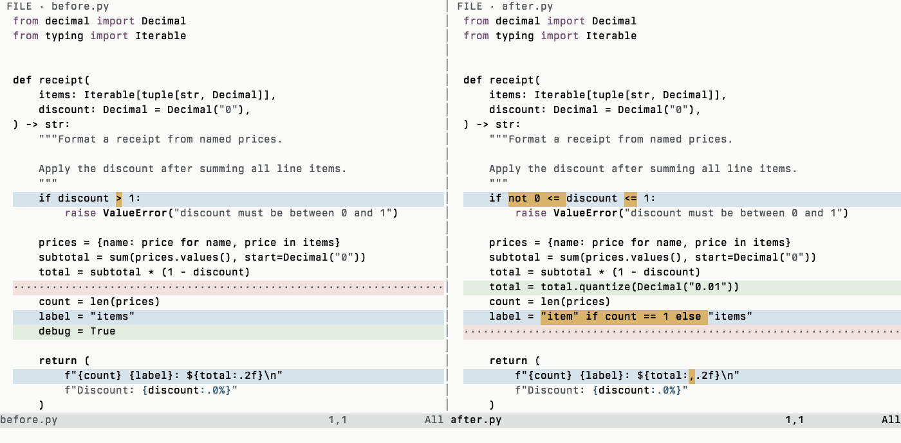
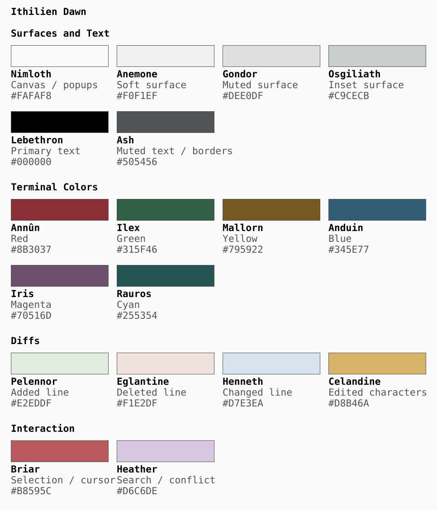

# Ithilien

A Neovim colorscheme: **Dawn**, a light theme for clear code and precise diffs.

Porcelain whites. Black type. Steel neutrals. A small, deliberate red accent.



**Read the code. Find the change.** Four diff backgrounds: green for added lines, red for deleted lines, blue for changed lines, and amber for the exact edited characters. Clients with separate added/deleted word highlights use the same amber for both. Diff emphasis keeps ordinary text weight, so even a one-character edit stands out through color.

[Install](#install) · [Usage](#usage) · [Palette](#palette) · [Design](#design) · [Extras](#extras)

## Install

Install with [lazy.nvim](https://github.com/folke/lazy.nvim):

```lua
{
  "achandran/ithilien",
  dependencies = { "webhooked/kanso.nvim" },
  lazy = false,
  priority = 1000,
  opts = { bold = true, italics = true },
  config = function(_, opts)
    require("ithilien").setup(opts)
    vim.cmd.colorscheme("ithilien-dawn")
  end,
}
```

Requires Neovim with truecolor enabled (`vim.opt.termguicolors = true`) and
Kansō. Python and the repository's build tools are only needed for development.

### LazyVim

Use this complete configuration instead of the minimal lazy.nvim example above.
Save it as `~/.config/nvim/lua/plugins/ithilien.lua`, then run `:Lazy sync`.
It includes lualine integration.

```lua
return {
  {
    "achandran/ithilien",
    branch = "main",
    dependencies = { "webhooked/kanso.nvim" },
    lazy = false,
    priority = 1000,
    opts = {
      bold = true,
      italics = true,
    },
  },
  {
    "LazyVim/LazyVim",
    opts = {
      colorscheme = "ithilien",
    },
  },
  {
    "nvim-lualine/lualine.nvim",
    opts = function(_, opts)
      require("ithilien.statusline").configure(opts)
    end,
  },
}
```

Update the plugin with `:Lazy update`.


## Usage

```lua
vim.cmd.colorscheme("ithilien-dawn") -- light
```

`ithilien` is an alias for Dawn. Setup is optional when using the default bold
and italic syntax styles. Exact diff emphasis uses ordinary weight and color.

## Palette



Colors are grouped by surfaces and text, terminal colors, diffs, and interaction. The six terminal colors also serve application accents; Rauros supplies both cyan and aqua text. Each swatch shows its palette name, a representative role, and exact hex value. Shared colors can serve additional roles; see the full reference below.

The palette and preview images are generated from the theme sources so they stay in sync. The Neovim image above uses actual captured UI-cell colors, rasterized with Berkeley Mono Medium at 16 pt. It shows built-in Python syntax, not a Tree-sitter/LSP configuration or a native Ghostty screenshot.

[Full palette reference](docs/palette-names.md)

## Design

Dawn takes its visual direction from the **Formex Reef GMT with a white dial, black ceramic bezel, and stainless steel bracelet**: clear markings on a quiet surface, metallic neutrals, and red used deliberately for interaction. Its color names draw from Tolkien’s Ithilien and the wider world of Middle-earth.

The aim is a working environment that stays legible without turning every token into an accent. Black carries the text. Muted syntax colors distinguish structure. Stronger backgrounds identify changes, search matches, and selection.

- **Precise diffs.** Locate added, removed, and changed code, down to individual characters and punctuation.
- **Readable agent sessions.** Support code, explanations, patches, and tool output in Codex and Claude Code. Native Codex replay is tested; Claude Code coverage is still developing.
- **Long-session comfort.** Light surfaces, dark text, and restrained decoration are design goals. Automated contrast checks support them; they do not prove comfort.
- **Consistent interactions.** Briar marks selection and the cursor with black foreground text. Search and inline edits use different hues.

The Neovim implementation builds on [Kansō](https://github.com/webhooked/kanso.nvim), with Ithilien’s palette and highlight mappings. Dawn is the current design and evaluation baseline.

## Extras

Matching terminal and application ports live in [extras/](extras/README.md),
following [Kansō's layout](https://github.com/webhooked/kanso.nvim/tree/main/extras).
These include Ghostty, Codex, Claude Code, Firefox, Zsh, Slack, Linear, macOS
selection scripts.

Copy or source the files for the applications you use; see the manual
installation instructions below.

[Extra installation instructions](docs/installation.md) ·
[Development](docs/development.md) · [Tintprobe evaluator](https://github.com/achandran/tintprobe) · [Preview details](docs/development.md#preview-assets)
