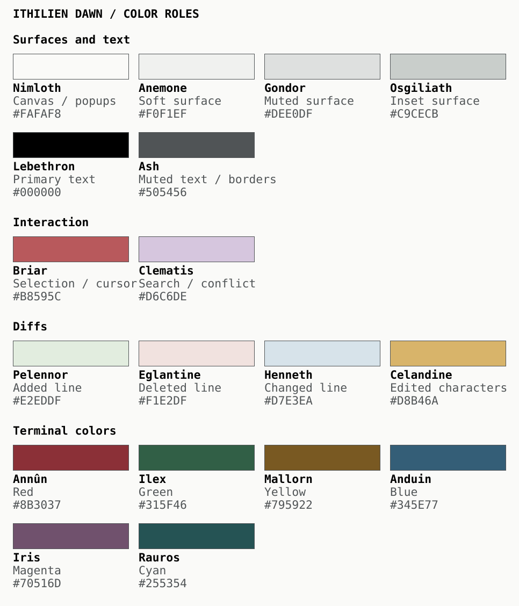

# Ithilien

Coding themes for long sessions and precise diffs. Dawn draws on the Formex Reef GMT white dial and steel bracelet, with Zenbones typography.

| Theme | Canvas | Main text |
| --- | --- | --- |
| **Dawn** · light | `#F6F6F3` | `#25292B` |
| **Dusk** · dark | `#171812` | `#C9BA99` |

## Dawn palette

Named colors drawn for Ithilien’s plants, landscape, people and immediate neighbours.



[Text palette and name sources](docs/palette-names.md) · [Interactive palette lab](palette-preview.html)

## Reading and diffs

- Neutral-white Dawn surfaces and restrained syntax; dark graphite foregrounds, including selections and status lines.
- Distinct added, removed and changed lines. Dawn’s exact changed characters are **dark and underlined** in Neovim; selected text stays dark.

## Install

| Application | Files / setup |
| --- | --- |
| Neovim / LazyVim | [Plugin spec](nvim/lazyvim-plugin.lua); `:colorscheme ithilien-dawn` or `ithilien-dusk` |
| Ghostty | Copy [themes](ghostty/themes/) to `~/.config/ghostty/themes/` |
| Codex | Copy [themes](codex/themes/) to `~/.codex/themes/`; choose with `/theme` |
| Claude Code | Copy [themes](claude-code/themes/) to `~/.claude/themes/`; choose with `/theme` |
| Firefox | [Extension](firefox/manifest.json) |
| Zsh | [Selection config](shell/ithilien.zsh) |
| macOS | [Selection script](macos/apply-highlight.sh) · [Dynamic wallpaper](wallpapers/ithilien.heic) |
| Slack / Linear | [Slack](slack/) · [Linear](linear/) theme strings |

Ghostty automatic appearance:

```ini
theme = light:ithilien_dawn.conf,dark:ithilien_dusk.conf
```

[Installation details](docs/installation.md), including Neovim dependencies and macOS appearance switching. `ithilien` defaults to Dawn.

## Build and check

Requires Python 3.12+ and [uv](https://docs.astral.sh/uv/).

```sh
uv sync
uv run python scripts/build.py
uv run python -m unittest discover -s tests
```

Edit the [canonical palettes](palette/), then rebuild; generated themes, palette chart and reference update together. Dawn stores each hex once under `colors`; roles reference names.

[Dawn audit](reports/ithilien-dawn-audit.md) · [Dusk audit](reports/ithilien-dusk-audit.md) · [Python review](reports/python-review/README.md)

## Formex Dawn development

The selected Neutral white palette is now on `main`. See [implementation report](reports/formex-dawn-implementation.md) for verification and remaining native application checks. The bundled wallpaper remains the prior design; Firefox and selection exports now include Dawn and Dusk.

### Dawn cursor: the GMT red tip

Dawn uses an Eglantine (`#F1E2DF`) Ghostty block cursor with Lebethron (`#25292B`) text. The same pair stays readable when an application changes the cursor shape. Neovim adds a Rosehip (`#A3373E`) underline to its pale block; exported carets retain Rosehip. Selections remain Harlond blue. Dawn explicitly sets `minimum-contrast = 1`: the higher setting caused unreadable blocks in zsh vi mode. Cursor text contrast is tested independently of the default shape, without relying on terminal contrast correction.

### Install or update detected apps

Requires Python 3. After pulling this branch, run:

```sh
./install.sh             # preview changes
./install.sh --apply     # install; back up replaced files
```

Use `--only ghostty codex` to limit the apps. Ghostty is activated automatically; LazyVim receives a local-checkout plugin spec (restart and run `:Lazy sync`). Codex/Claude Code receive theme files and require `/theme` selection. Slack/Linear display import values. Missing apps are skipped. Zsh receives a backed-up managed source line in `.zshrc`. Firefox receives theme files for manual activation. Mobile, wallpaper, and system-wide selection are not automatically changed. See [installer details](docs/installation.md#one-command-installer).

### Compare against Kanso Pearl and Zenbones

Run `python3 scripts/compare.py` for isolated Ghostty launch commands, then follow the [comparison exercises](comparison/README.md). Your installed settings are not changed.
